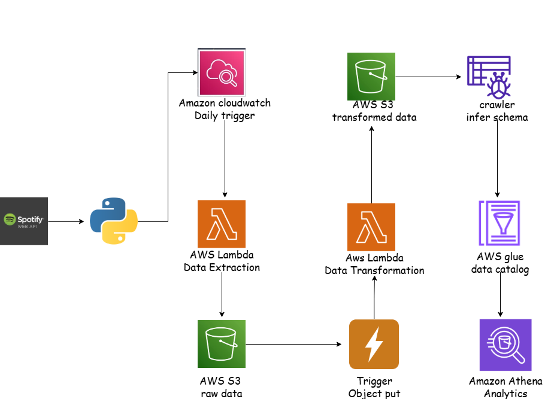

# Spotify End-to-End Data Engineering Pipeline (AWS)

An automated, event-driven ETL pipeline that extracts music data from the Spotify API, transforms it, and loads it into a queryable data store — built entirely on AWS serverless services.

---

## Overview

This project demonstrates a real-world, production-style data engineering pipeline. It continuously pulls data from the Spotify API, processes it through a series of automated stages, and makes it available for SQL-based analysis — with no manual intervention required at any step.

**Key characteristics:**
- Fully automated and event-driven (each stage triggers the next)
- Serverless architecture (no servers to manage or maintain)
- Near real-time data extraction (runs every 1 minute)
- Query-ready output via SQL (Amazon Athena)

---

## Architecture

---

## Pipeline Stages

### 1. Data Extraction
An AWS Lambda function connects to the Spotify API and pulls raw music data (tracks, albums, artists). This function runs automatically every 1 minute, ensuring the pipeline stays continuously up to date. Extracted data is saved to a dedicated "to-be-processed" folder in Amazon S3.

### 2. Raw Data Storage
Amazon S3 acts as the central storage layer for the pipeline. Raw data lands here first, in a holding folder, before any processing occurs.

### 3. Event-Driven Trigger
An S3 event notification detects the moment a new raw file is added and automatically triggers the next stage — no scheduling or polling required.

### 4. Data Transformation
A second Lambda function is triggered to clean, reshape, and organize the raw data. Transformed data is written into structured folders in S3 (separated by data type), and the original raw file is moved into a "processed" folder to prevent duplicate processing.

### 5. Automatic Schema Detection
An AWS Glue Crawler scans newly transformed data, detects its structure, and updates the AWS Glue Data Catalog — removing the need to manually define schemas.

### 6. Querying
Once cataloged, the data can be queried directly with standard SQL using Amazon Athena — without loading it into a separate database.

---

## Tech Stack

| Stage | AWS Service | Purpose |
|---|---|---|
| Extraction | AWS Lambda | Pulls raw data from the Spotify API on a scheduled interval |
| Raw Storage | Amazon S3 | Stores raw and processed data in organized folders |
| Trigger | S3 Event Notification | Detects new files and triggers downstream processing automatically |
| Transformation | AWS Lambda | Cleans and restructures raw data into organized, queryable formats |
| Schema Detection | AWS Glue Crawler | Automatically catalogs data structure for querying |
| Querying | Amazon Athena | Runs SQL queries directly on data stored in S3 |
| Language | Python | Used for Lambda function logic and Spotify API integration |

---

## Data Flow Summary

**Extract** → Spotify API data is pulled via Lambda every 1 minute and stored raw in S3
**Transform** → A second Lambda function cleans and reorganizes the data into structured S3 folders
**Load** → AWS Glue catalogs the data automatically, making it immediately queryable in Athena

---

## What This Project Demonstrates

- Building serverless ETL pipelines using AWS Lambda
- Designing event-driven architectures with S3 triggers
- Automating schema detection and cataloging with AWS Glue
- Querying data at rest using Amazon Athena and SQL
- Working with real-world third-party APIs (Spotify)
- End-to-end data pipeline design: extraction → transformation → storage → querying

---

## Future Improvements

- Add data validation checks at the transformation stage
- Introduce orchestration with AWS Step Functions or Apache Airflow
- Add a visualization layer (e.g., Amazon QuickSight) on top of Athena queries
- Implement error handling and dead-letter queues for failed Lambda executions

---

## Author

**Vinay A Kelur**
[LinkedIn](#) • [GitHub](#)
